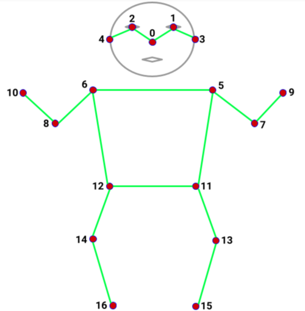

# Human body recognition 

This repo is capable of doing real-time human body recognition on videos, camera feed and pictures.

The project was developed using the Tensorflow MoveNet Thunder model, which offers us high-accuracy. It was developed to be used in real world project, having +30 FPS values.

It is able to generate 17 keypoints of the human body, which are indexed like this:
```python
KEYPOINT_DICT = {
        "nose": 0,
        "left_eye": 1,
        "right_eye": 2,
        "left_ear": 3,
        "right_ear": 4,
        "left_shoulder": 5,
        "right_shoulder": 6,
        "left_elbow": 7,
        "right_elbow": 8,
        "left_wrist": 9,
        "right_wrist": 10,
        "left_hip": 11,
        "right_hip": 12,
        "left_knee": 13,
        "right_knee": 14,
        "left_ankle": 15,
        "right_ankle": 16
    }
```



It also, calculates the angles of elbows, knees and the angle of the head with the body.

## Before you use it

**The best way for the model to work is to be fully captured and to be 1-2 meters (3ft-6ft) away from the camera.**

**The model is not intended for detecting poses of multiple people in the image**

## Body detection on videos


## Body detection on pictures


